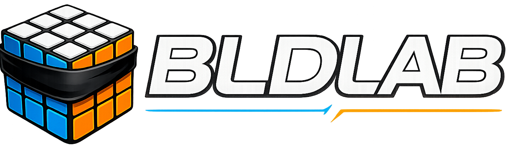

<p align="center">
  
</p>

<p align="center">
  An open-source platform for blindfolded Rubik's Cube solving.
</p>

---

## About

BLDLab is a web application built to simplify learning, organizing, and practicing blindfolded Rubik's Cube solving.

The project combines a community-driven algorithm database with powerful organization tools, allowing users to create personalized sheets, manage custom algorithms, and contribute new solutions. Future updates will introduce an adaptive trainer designed to help users focus on the cases that need the most practice.

Whether you're just getting started with blindfold solving or refining a highly optimized method, BLDLab aims to provide a flexible platform that grows with you.

---

## Current Features

* Community algorithm database
* Custom algorithm management
* Personalized sheet builder
* Support for Edges, Corners, 2e2c, LTCT, and T2C
* Custom lettering schemes
* Memory word management
* Guest mode with local browser storage
* User accounts with cloud synchronization
* Light and dark themes
* Community algorithm submission and review system

---

## Planned Features

* Adaptive training system
* Weighted case selection
* Solve statistics and progress tracking
* Google authentication
* Improved duplicate algorithm detection
* Mobile experience improvements
* Additional sheet types and training modes

---

## Tech Stack

### Frontend

* React
* Vite
* React Router
* CSS

### Backend

* Node.js
* Express
* MongoDB

### Algorithm API

* C#
* ASP.NET
* SQL Server

### Local Storage

* IndexedDB (Dexie)

---

## Getting Started

Clone the repository:

```bash
git clone https://github.com/RoweWH/BLDLab.git
```

Install dependencies:

```bash
npm install
```

Run the development server:

```bash
npm run dev
```

The backend services must also be running for full functionality.

---

## Contributing

Contributions, bug reports, and feature suggestions are always welcome.

If you'd like to contribute:

1. Fork the repository.
2. Create a feature branch.
3. Commit your changes.
4. Open a pull request.

For larger features or architectural changes, please open an issue first so they can be discussed before implementation.

---

## Roadmap

* ✅ Community algorithm database
* ✅ Custom sheet builder
* ✅ Guest mode
* ✅ User accounts
* ✅ Custom algorithms
* 🚧 Beta release
* 🚧 Adaptive trainer
* 🚧 Statistics
* 🚧 Google authentication

---

## License

A license will be added before the first stable release.

---

## Acknowledgements

BLDLab is a passion project created by **Rowe Hessler** for the blindfolded cubing community.

Special thanks to everyone who has tested the application, submitted algorithms, and provided feedback throughout development.
